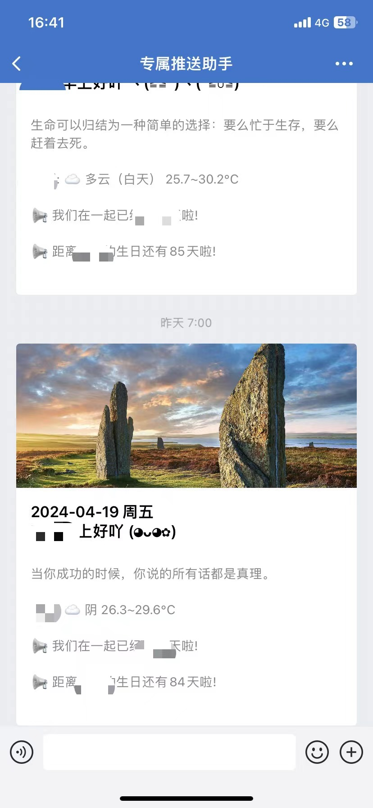
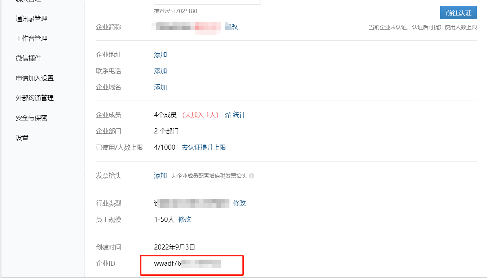
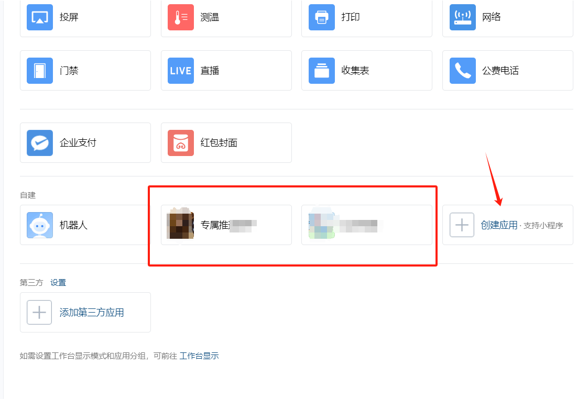
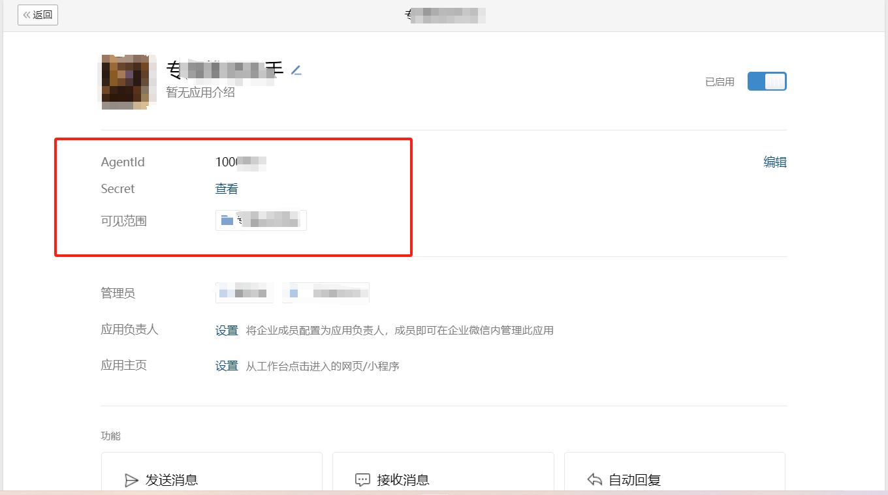
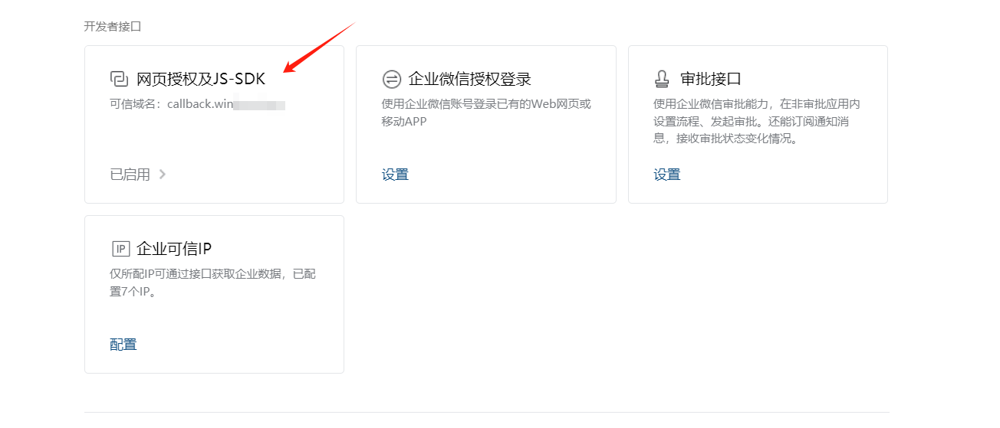

### 项目简介
通过调用企业微信接口发送模版消息
使用了**Scheduled**定时任务
corn在scheduled Task里面配置 这里默认的是每天早上7点发送
效果如下

### 配置类
配置application.properties
```properties
# 企业微信的ID
wechat.wxId=abcdefgh
# 企业微信的agentId
wechat.agentId=abcd
# 企业微信的secret
wechat.secret=abcd
# 天气接口的token 获取请看https://docs.caiyunapp.com/ doc文档
weather.token=3QIcwQM1pVC9JtQz
# 经度
weather.longitude=113.29934
# 纬度
weather.latitude=22.55329
weather.city=\u6df1\u5733
# 注意这里的City我选择的是用unicode编码 否则会报错 这里为城市名 例如 深圳
days.birthday=1949-07-12
days.loveDate=1949-05-20
```
#### 这里是企业微信配置
https://work.weixin.qq.com/wework_admin/frame#/profile

#### 这里先创建应用

#### 这里就能看到agentId和secret

#### 这里补充一点

要先开启网页授权及JS-SDK 以及将服务器的IP加入到IP白名单(企业可信IP)
#### 项目版权
项目简单 只是为了简单实现功能 欢迎二次开发
本项目为个人开发项目 仅供学习使用 请勿用于商业用途
云淡风轻 Blog:http://blog.winkovo.top
